⚡ SOHAM.A.CHAVAN

Computer Science & Engineering Student | Developer

 

> My Info:-

╔════════════════════════════════════════════════════════════╗
║                     SOHAM.A.CHAVAN                         ║
╠════════════════════════════════════════════════════════════╣
║ ROLE      : Computer Engineering Student | Developer       ║
║ LOCATION  : Pune, India                                    ║
║ FOCUS     : Software Development • Web • Problem Solving   ║
║ STATUS    : ONLINE                                         ║
╚════════════════════════════════════════════════════════════╝

I enjoy turning concepts into practical software, exploring new technologies, and continuously improving my development skills.

> tech_stack

Languages

Frameworks & Tools

learning.exe

[████████████████████░░] React
[██████████████████░░░░] Advanced Python
[█████████████████░░░░░] Full Stack Development

> project_database

AUTO-SYNC ENABLED — public repositories are discovered automatically.

<!-- PROJECTS:START -->

    ### `NO PUBLIC BUILDS DETECTED`

    Create a public repository and push your first project.

<!-- PROJECTS:END -->

> github_analytics

  

 

> contribution_snake

CYAN • BLUE • PURPLE • PINK • GREEN • YELLOW

> activity.log

> connect

╭────────────────────────────────────────────────────╮
│  SYSTEM STATUS : ONLINE                             │
│  BUILD         : IN PROGRESS                        │
│  MODE          : LEARN • BUILD • CREATE             │
╰────────────────────────────────────────────────────╯

// Keep building.

